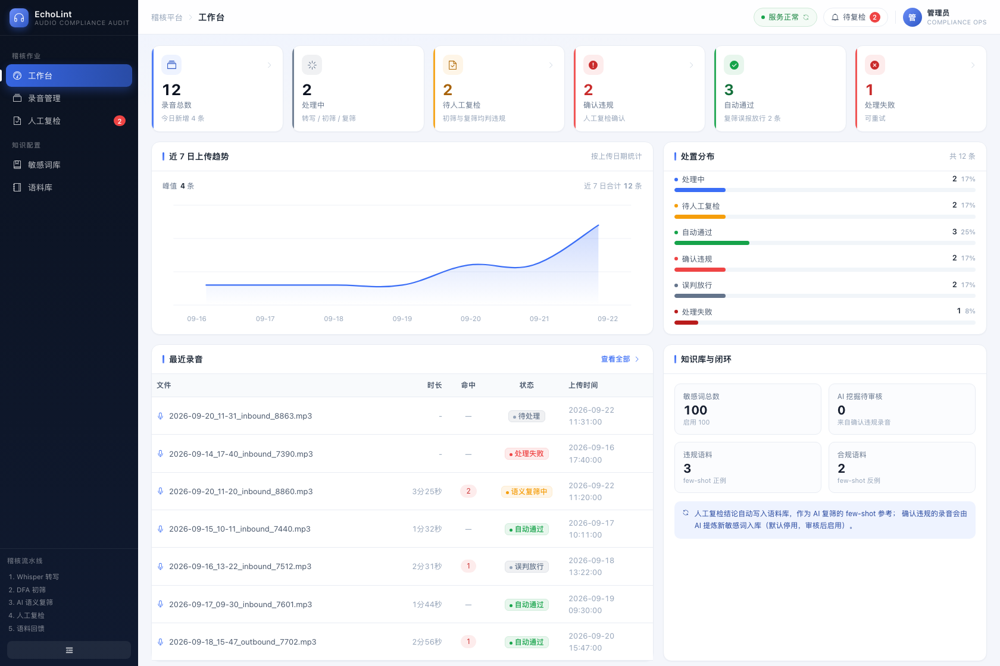
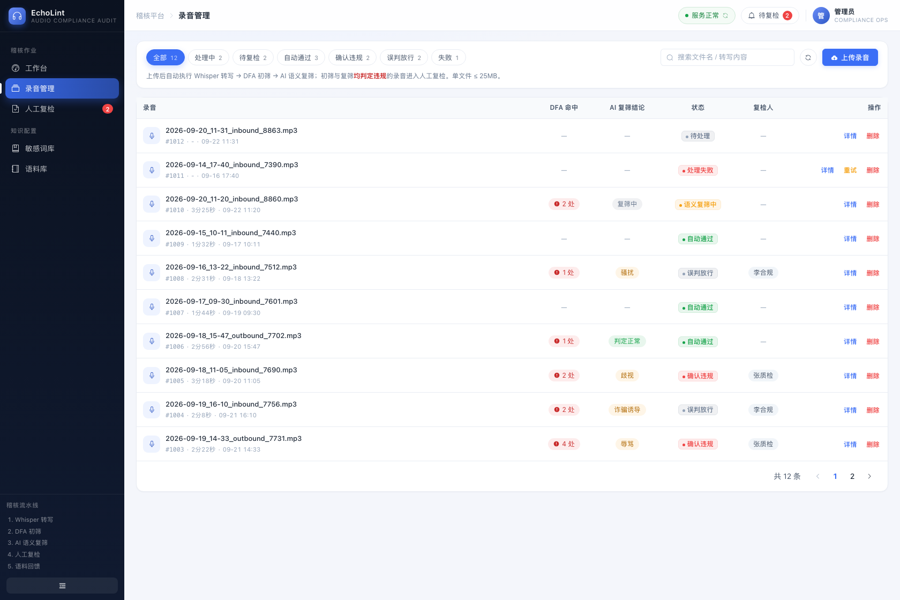
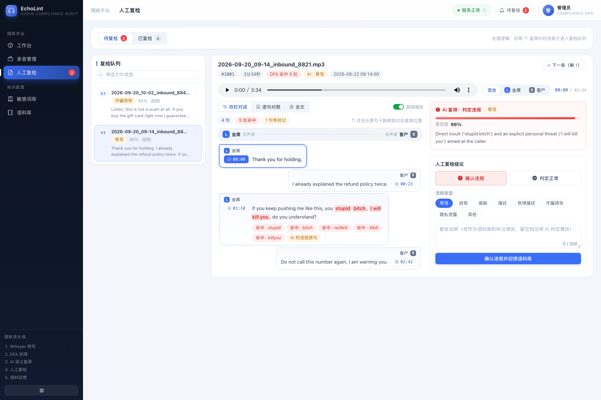
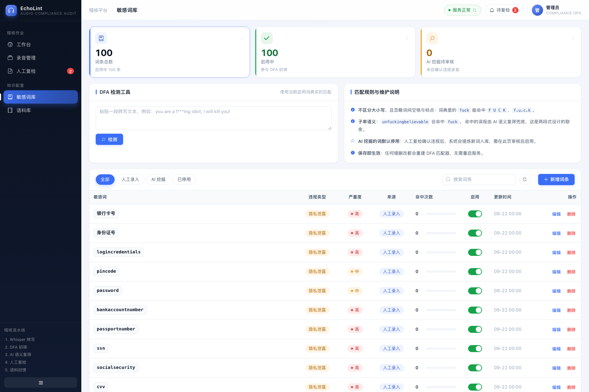
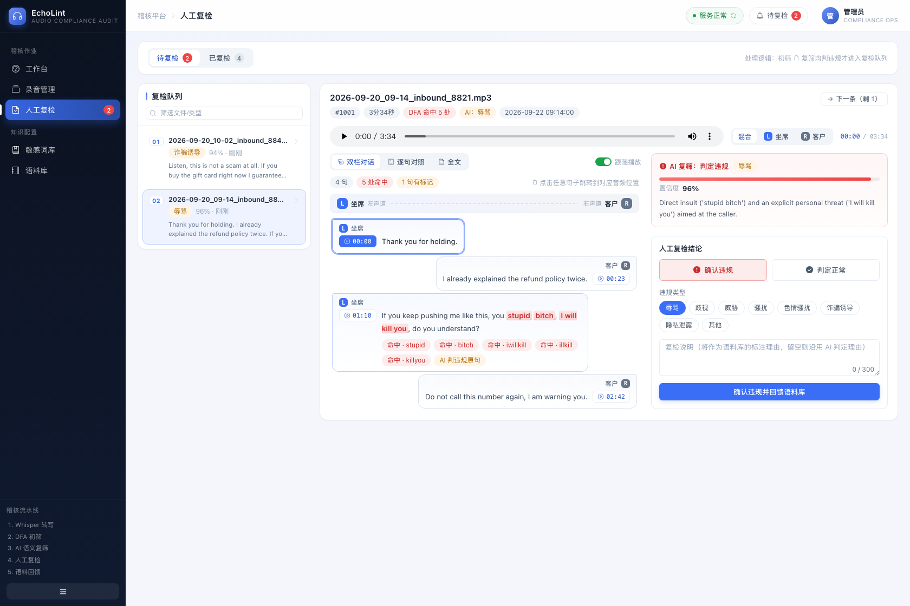

# EchoLint · 录音稽核平台

> **EchoLint** = Echo（录音） + Lint（自动化体检）：把每一通录音当作待检代码，先机械地查关键词，再让 AI 读语境，最后交给人拍板。

基于 **OpenAI Whisper** 的录音合规稽核服务：录音上传后自动完成 **转写 → DFA 初筛 → AI 语义复筛 →（命中则）人工复检**，人工复检结论自动回馈语料库，并从中挖掘新敏感词，形成自增长闭环。

## 总体流程

```
┌────────┐   ┌───────────────────┐   ┌──────────────┐   ┌───────────────────┐   ┌──────────────┐
│ 手动上传 │ → │ ① Whisper 英转文   │ → │ ② DFA 初筛    │ → │ ③ AI 语义复筛      │ → │ ④ 人工复检     │
│ (≤25MB) │   │   (whisper-1)     │   │  敏感词词典    │   │   (gpt-4o-mini)   │   │  confirm/reject│
└────────┘   └───────────────────┘   └──────┬───────┘   └─────────┬─────────┘   └──────┬───────┘
                                            │ 未命中               │ 不构成违规          │
                                            ▼                     ▼                    │
                                        自动通过 ──────────→ 自动通过                  │
                                            ▲                                          │
                                            └──────────── 初筛 ∪ 复筛均违规 ──────────┘
                                                                          │
                                             ⑤ 结论回馈语料库 (few-shot)  │
                                             └── 挖掘新词 → 词典(停用待审核) ←┘
```

- **DFA 初筛**：Aho-Corasick 自动机 + 字符跳变（`f u c k`、`f.u.c.k` 也能命中 `fuck`），大小写不敏感。
  > 跳变只允许字母之间插入分隔符；字母缺失的写法（如 `f**k` 少了 `u`/`c`）不命中，这类漏网由 AI 语义复筛与人工复检兜底。
- **双声道（双轨）录音**：自动探测声道数，立体声时分离左右声道并**分别转写**，按时间对齐成对话（详见下文）。
- **AI 复筛**：GPT-4o mini 结合上下文判断命中词是否构成真实违规，`few-shot` 自动注入人工复核语料；双轨录音会带上**说话人标注**（坐席违规与客户辱骂性质不同）。
- **人工复检**：初筛 + 复筛均判违规 → 进入复检队列；确认违规 / 判定误报。
- **语料回馈**：复检结论写入语料库（复筛时作为参考案例）；确认违规的录音由 AI 挖掘新敏感词入库（默认停用，人工审核后启用）。

## 技术栈

| 层 | 技术 |
|---|---|
| 后端 | Spring Boot 3.3 / Java 17, Spring Data JPA, WebClient, MySQL 8 |
| 前端 | Vue 3 + Vite + Element Plus + vue-router + axios |
| 部署 | docker-compose（MySQL + 后端 + Nginx 前端） |

## 目录结构

```
echolint/
├── backend/                      # Spring Boot 后端
│   ├── src/main/java/com/echolint/
│   │   ├── config/               # 配置：OpenAI、异步流水线、CORS/静态资源
│   │   ├── controller/           # 录音/复检/词典/语料/统计 接口
│   │   ├── dfa/                  # DFA 匹配器（AC 自动机 + 词规范化）
│   │   ├── domain/               # 枚举（状态机/违规类型/严重度）
│   │   ├── entity/               # JPA 实体
│   │   ├── exception/            # 业务异常与全局异常处理
│   │   ├── repository/
│   │   └── service/              # 流水线/转写/复筛/复检/挖掘/语料/统计
│   ├── src/main/resources/       # application.yml + 预置词库 data.sql
│   └── src/test/                 # DFA 单元测试
├── frontend/                     # Vue3 前端（工作台/录音管理/人工复检/敏感词库/语料库）
│   └── src/styles/index.css      # 设计令牌 + Element Plus 主题层
├── tools/seed_demo_data.py       # 演示数据生成/清理（预览 UI 用）
├── docs/screenshots/             # 界面截图
├── docker-compose.yml            # 一键部署
└── .env.example                  # OPENAI_API_KEY 配置样例
```

## 管理端界面

统一的设计语言：深色侧栏 + 浅色内容区、6px 圆角体系、字重/字距收敛、状态用「圆点 + 文字」胶囊表达。

| 工作台 | 录音管理 |
|---|---|
|  |  |

| 人工复检 | 敏感词库 |
|---|---|
|  |  |

双声道（双轨）录音的双栏对话视图与分声道试听：



- **工作台**：6 个 KPI 卡（可点击跳转对应筛选）+ 近 7 日趋势折线（悬停查看数值）+ 处置分布条 + 知识库闭环面板。
- **录音管理**：状态胶囊筛选（带各状态数量）、行内命中/AI 结论/复检人、详情抽屉含**音频播放器**、AI 结论置信度条、命中词高亮、处理轨迹时间线；有处理中记录时自动轮询刷新。
- **人工复检**：左侧复检队列（可筛选）+ 右侧工作区（**逐句对照转写**、AI 判断置信度条、结论表单）；打开时**默认选中 AI 建议的违规类型**，提交后自动进入下一条。
- **逐句对照 + 音画联动**：每句话带起始时间、DFA 命中词高亮与标记胶囊（`命中 · xxx` / `AI 判违规原句`）；**点击句子跳转到对应音频时间点**，播放时**自动高亮并滚动到当前句**（可用「跟随播放」开关关闭），也可切回「全文」视图。
- **双栏对话 + 分声道试听**：双轨录音默认以左右双栏对话展示（左=坐席、右=客户），播放器可切「混合 / 坐席 / 客户」单独试听某一路。
- **敏感词库**：KPI 概览、DFA 检测工具（命中实时高亮预览）、词条表含命中次数条形图，AI 挖掘词带「待审核」标记。
- **语料库**：闭环流程说明条、违规/合规样本分类查看、导出 JSON。

### 双声道（双轨）录音

呼叫中心的双轨录音通常是 **左声道 = 坐席、右声道 = 客户**。系统会自动识别并分开处理：

```
上传 → ffprobe 探测声道数
        ├─ 1 声道：单路 Whisper 转写
        └─ 2 声道：ffmpeg 分离左右声道 → 两路分别 Whisper 转写 → 按 start 时间对齐合并
                     ↓
        转写文本（供 DFA/AI 复筛）+ 带 speaker/channel 的分段（供双栏对话视图）
```

| 能力 | 说明 |
|---|---|
| 双栏对话视图 | 左栏坐席、右栏客户，按时间顺序排列，气泡左右分明；保留时间戳、命中高亮、AI 原句标记、点击跳转、播放跟随 |
| 分声道试听 | 播放器旁可切「混合 / 坐席(左) / 客户(右)」，只听某一路 |
| AI 复筛增强 | 复筛与挖掘时文本按 `【坐席】…【客户】…` 标注，模型能区分"坐席辱骂客户"与"客户辱骂坐席" |
| 说话人可配置 | `app.stereo.left-speaker` / `right-speaker`（默认 坐席 / 客户） |
| 成本 | 双轨录音会调用 **两次** Whisper（每路一次），token 消耗约为单路的两倍 |
| 降级 | 未安装 ffmpeg、探测失败或分离失败 → 自动退回单路转写，不影响主流程 |

> Docker 镜像已内置 ffmpeg/ffprobe；**本地开发需自行安装**（macOS: `brew install ffmpeg`），否则双声道能力降级为单路。

### 逐句转写的数据来源与降级策略

| 场景 | 表现 |
|---|---|
| Whisper 返回 `verbose_json` 分段（`segments[].start/end/text`） | 每句带时间轴，音画双向联动完整可用 |
| 双声道录音（分段带 `speaker`/`channel`） | 额外提供「双栏对话」视图 + 分声道试听 |
| 无分段数据（历史数据 / 非标准转写） | 按句末标点切句展示文本与标记，时间戳显示 `--:--`，点击不跳转并在顶部提示 |
| AI 原句与分段边界不一致 | 先按全文偏移定位，失败则回退为「句子包含原句 / 原句包含句子」的匹配（原句带 `【说话人】` 前缀会先剥离） |

句子与命中的归属逻辑（含偏移定位、区间合并、播放定位）抽成了纯函数 `frontend/src/utils/segments.js`，并有单元测试：

```bash
cd frontend && npm test     # node --test，10 个用例
```

## 演示数据（可选）

想在空环境下预览界面：

```bash
python3 tools/seed_demo_data.py          # 写入 12 条演示录音（id >= 1000，含分段/命中/AI 结论）
python3 tools/seed_demo_data.py --with-audio   # 额外生成 #1001 的音轨：
                                               #   混合(静音) / 左声道 440Hz / 右声道 660Hz
                                               # 并把 #1001 造成双声道样本，可直接体验双栏对话与分声道试听
python3 tools/seed_demo_data.py --clean  # 清理演示数据
```

脚本会调用运行中的后端 `/api/dictionary/test` 计算命中位置，因此需要后端已启动；
默认后端地址 `http://localhost:8082`、MySQL 容器 `echolint-mysql`，可用 `--api` / `--container` 覆盖。

## 快速开始（Docker 一键）

```bash
# 1. 配置 OpenAI 密钥（也可直接用环境变量）
cp .env.example .env
#   编辑 .env，填入 OPENAI_API_KEY=sk-...

# 2. 构建并启动（首次构建需数分钟）
docker compose up -d --build

# 3. 访问
#    前端:   http://localhost:8081   （后端 API 经 Nginx 同源代理）
#    后端:   http://localhost:8082   （健康检查 /actuator/health）

# 端口说明（宿主机）：前端 8081 → Nginx:80；后端 8082 → 8080；MySQL 3307 → 3306。
# 若与本机已有服务冲突，改 docker-compose.yml 中的宿主机端口映射即可。
```

停止：`docker compose down`（数据保存在 named volume，`docker compose down -v` 可清空）。

## 本地开发

```bash
# 0. 准备 MySQL（compose 已把容器 3306 映射到宿主 3307，避免与本机 MySQL 冲突）
docker compose up -d mysql

# 1. 后端（通过 3307 连容器 MySQL；若本机 3306 空闲可改回默认 URL）
cd backend
export OPENAI_API_KEY=sk-...
export SPRING_DATASOURCE_URL='jdbc:mysql://localhost:3307/echolint?useUnicode=true&characterEncoding=utf8&serverTimezone=UTC&allowPublicKeyRetrieval=true&useSSL=false'
mvn spring-boot:run

# 2. 前端（开发服务器，/api 与 /uploads 默认代理到 8080；
#    若后端跑在别的端口，用 VITE_API_TARGET 覆盖，例如 compose 的 8082）
cd frontend
npm install
VITE_API_TARGET=http://localhost:8082 npm run dev
```

### 环境变量（均有默认值）

| 变量 | 默认 | 说明 |
|---|---|---|
| `OPENAI_API_KEY` | (空) | OpenAI 密钥，缺失时转写/复筛会置录音为 FAILED |
| `OPENAI_BASE_URL` | `https://api.openai.com` | 可指向代理/网关 |
| `OPENAI_WHISPER_MODEL` | `whisper-1` | 转写模型 |
| `OPENAI_SCREEN_MODEL` | `gpt-4o-mini` | 语义复筛 + 词挖掘模型 |
| `SPRING_DATASOURCE_URL/USERNAME/PASSWORD` | localhost:3306, audit/audit123 | 数据库连接 |
| `APP_UPLOAD_DIR` | `data/uploads` | 录音文件存储目录 |
| `APP_STEREO_ENABLED` | `true` | 是否启用双声道分轨处理 |
| `APP_STEREO_LEFT_SPEAKER` | `坐席` | 左声道说话人名称 |
| `APP_STEREO_RIGHT_SPEAKER` | `客户` | 右声道说话人名称 |

## API 一览

| 方法 | 路径 | 说明 |
|---|---|---|
| POST | `/api/recordings/upload` | 上传录音（multipart `file`），异步启动稽核流水线 |
| GET | `/api/recordings?statuses=&keyword=&page=&size=` | 录音分页查询（statuses 逗号分隔） |
| GET | `/api/recordings/{id}` | 详情（转写/命中/复筛结果/复检信息） |
| GET | `/api/recordings/{id}/logs` | 处理轨迹日志 |
| POST | `/api/recordings/{id}/retry` | 失败重试 |
| DELETE | `/api/recordings/{id}` | 删除（含文件与日志） |
| POST | `/api/reviews/{id}` | 人工复检 `{result: CONFIRMED_VIOLATION\|FALSE_POSITIVE, violationType?, comment?}` |
| GET/POST/PUT/DELETE | `/api/dictionary...` | 敏感词 CRUD（变更后自动重建 DFA 匹配器） |
| POST | `/api/dictionary/test` | 检测工具：`{text}` → 命中列表 |
| GET/POST/DELETE | `/api/corpus...` | 语料库查询/录入/删除 |
| GET | `/api/corpus/export` | 语料导出 JSON |
| GET | `/api/stats/overview` | 工作台统计 |

## 录音状态机

```
PENDING → TRANSCRIBING → DFA_CHECKING → AI_CHECKING → NEEDS_REVIEW → VIOLATION_CONFIRMED
                                                      │            └───────→ FALSE_POSITIVE
                                                      └──→ COMPLIANT（任一步判定合规）
任意步骤异常 → FAILED（可在录音管理重试）
```

## 词典使用说明

- 词条保存时自动**规范化**：小写、去空格/标点（`Kill You` → `killyou`），匹配时原文中的空格/标点不影响命中（`f u c k`、`f.u.c.k` 均可命中 `fuck`）。
- 匹配为**子串语义**（`unfuckingbelievable` 会命中 `fuck`），且不做字母替换（`f**k` 不命中由复筛兜底），误报由 AI 复筛兜底——这是两段式设计的初衷。
- **AI 挖掘的新词默认停用**，需在敏感词库页人工审核后启用（列表按 `来源=AI 挖掘` 过滤）。
- 预置词典面向通用客服质检场景（辱骂/歧视/威胁/骚扰/色情/诈骗/隐私），可增删改。

## 注意事项

- Whisper 单文件上限 **25MB**（OpenAI 限制），上传接口同样限制；更长的录音请先切分或压缩。
- 语义复筛调用失败时，DFA 命中的录音会**降级转入人工复检**（aiResultJson 中带错误说明），不会漏审。
- 语料库初始含 5 条合成样例，随人工复检的积累会逐渐替换为真实标注数据。