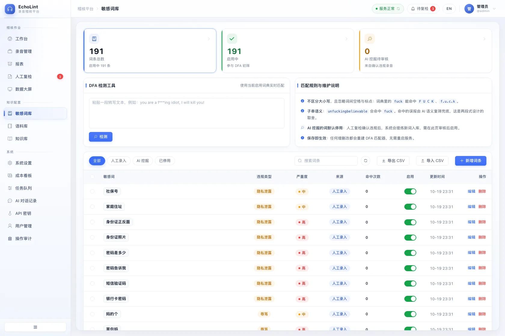
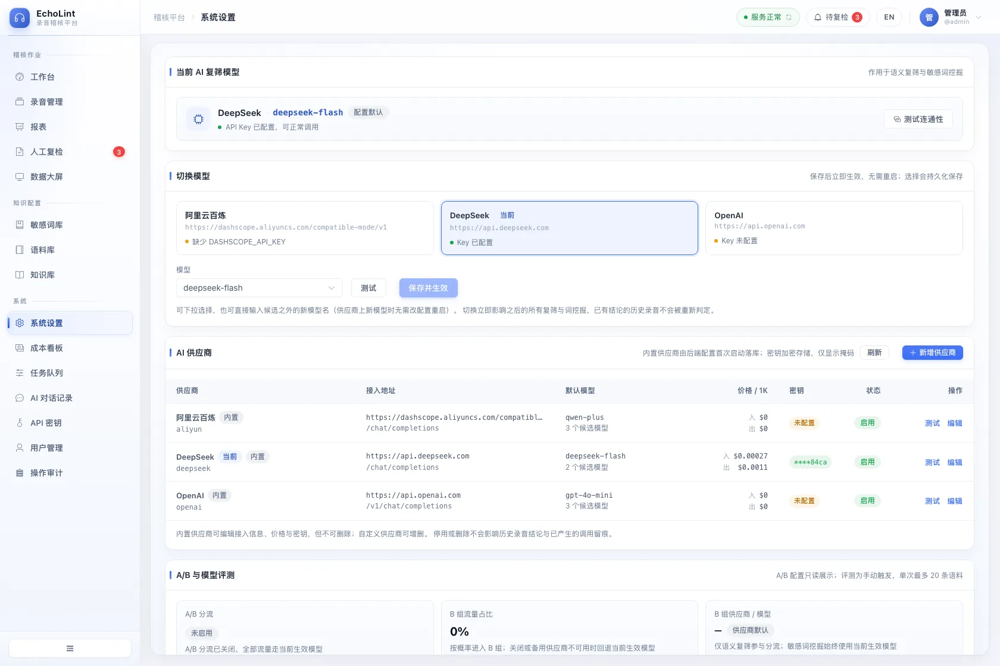
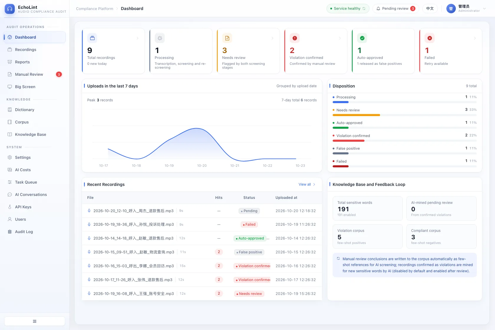
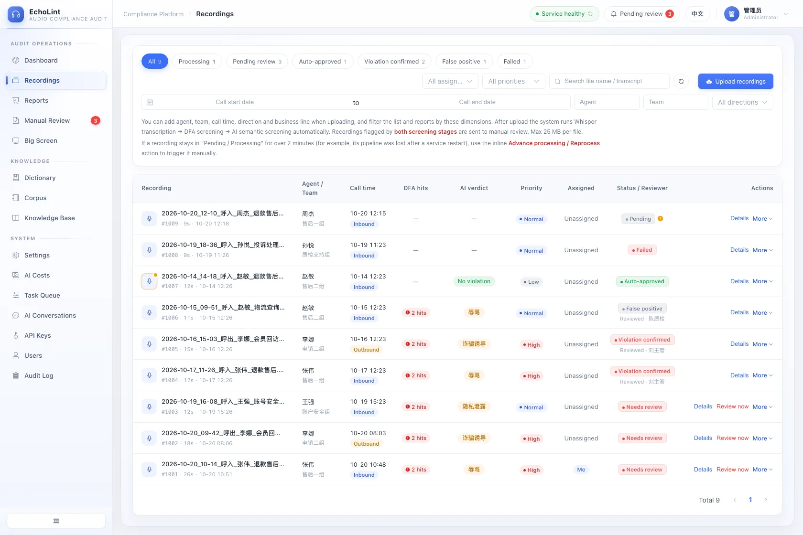
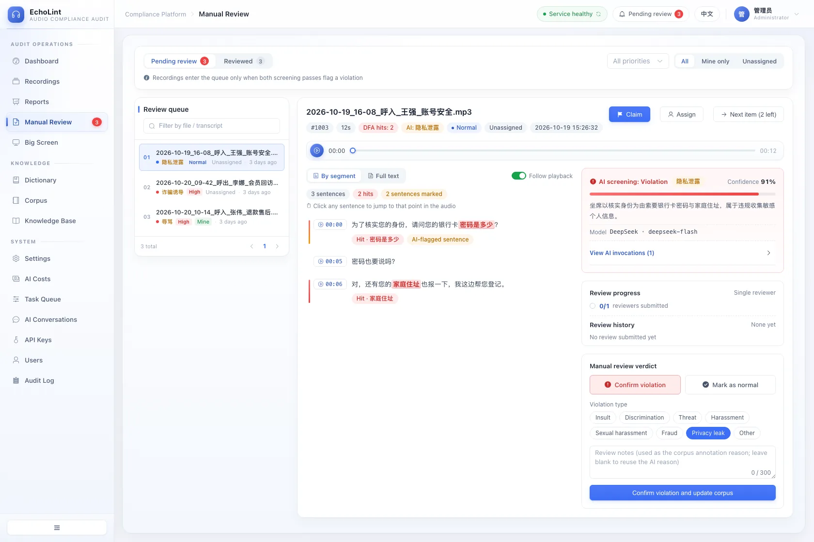
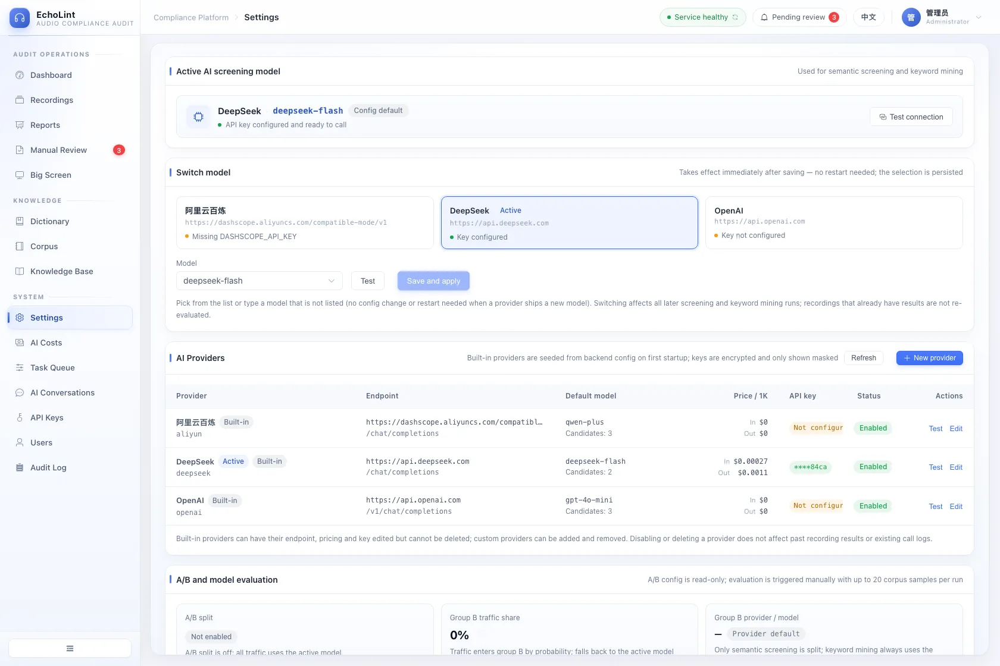

# EchoLint · 录音稽核平台

> 把每一通录音当作待检代码：先机械查词，再让 AI 读语境，最后交给人拍板。

EchoLint 是录音合规稽核服务，语音转写支持**阿里云百炼 / 本机 whisper.cpp 双方案运行时切换**：上传后自动完成
**转写 → DFA 初筛 → AI 语义复筛 →（命中则）人工复检**，复检结论回馈语料库并挖掘新敏感词，
形成自增长闭环；支持 PostgreSQL + pgvector 知识库 RAG、AI 调用全程留痕，以及**全站中 / 英双语**。

## 界面

| 工作台 | 录音管理 |
|---|---|
|  |  |

| 人工复检 | 敏感词库 |
|---|---|
|  |  |

| 录音详情（逐句对照 / 命中高亮 / 处理轨迹） | 双声道（双轨）对话 |
|---|---|
|  |  |

| 数据大屏 | 系统设置（复筛模型[含供应商管理] / 语音转写 / 知识增强 / 通知与抽样 / 运行环境） |
|---|---|
|  |  |

页头语言按钮可切换中文 / English，选择持久化；路由标题、`<html lang>` 与 Element Plus 内置文案
（分页 / 日期 / 空态）同步切换。文案集中在 `frontend/src/i18n/messages/*.js`，zh/en key 严格对齐，
`npm test` 中的 i18n 用例与 `npm run i18n:audit` 守卫覆盖。

| Dashboard (EN) | Recordings (EN) |
|---|---|
|  |  |

| Manual Review (EN) | Settings (EN) |
|---|---|
|  |  |

> 后端返回的业务数据（转写文本、语料内容、AI 生成文案、文件名等）保持原语言，不属于前端词典范围。

## 核心能力

- **四段流水线**：语音转写（默认阿里云百炼录音文件识别，可在设置页切回本地 whisper.cpp）→ DFA 初筛（Aho-Corasick + 字符跳变，`f u c k` / `f.u.c.k` 也能命中）→
  AI 语义复筛（few-shot 语料 + 说话人标注）→ 人工复检；初筛与复筛均判违规才进复检队列。
- **闭环自增长**：复检结论自动写入语料库作为 few-shot 参考；确认违规的录音由 AI 挖掘新敏感词入库
  （默认停用，人工审核后启用）。AI 不可用时**降级转人工**，不漏审。
- **双声道（双轨）**：自动探测声道并分离左右轨分别转写、按时间对齐成对话；支持分声道试听与双栏视图；
  成本约为单路的两倍，分离失败自动降级单路。
- **AI 治理与成本**：供应商清单（内置 DeepSeek / 阿里云百炼，可接入任意 OpenAI 兼容网关）运行时切换，立即生效、
  重启保持；支持 A/B 分流、抽样评测、成本看板，以及完整提示词 / 原始回复 / token / 成本的调用留痕。
- **知识库 RAG**：PDF / DOCX / TXT / MD 导入 → 分块向量化（pgvector / HNSW）→ 复筛时语义召回注入；
  默认关闭（`APP_RAG_ENABLED=false`），不可用时自动降级为不注入。
- **工程能力**：持久任务队列（退避重试 / 死信）、Webhook 通知（HMAC 签名）、开放 API（`X-API-Key`）、
  操作审计、多角色（ADMIN / REVIEWER / VIEWER）与**用户级菜单绑定**（在角色允许范围内为每个账号勾选可见菜单，
  登录后侧栏与路由按绑定收窄）、单人 / 双人复核、数据大屏、响应式与键盘无障碍。

## 录音状态

```
PENDING → TRANSCRIBING → DFA_CHECKING → AI_CHECKING → NEEDS_REVIEW → VIOLATION_CONFIRMED
                                                      │             └──────→ FALSE_POSITIVE
                                                      └→ COMPLIANT（任一步判定合规）
任一步异常 → FAILED（可在录音管理重试/重新处理）
```

## 技术栈

| 层 | 技术 |
|---|---|
| 后端 | Spring Boot 3.5 / Java 17，Spring Data JPA，WebClient，Flyway，PostgreSQL 17 + pgvector |
| AI | 复筛/词挖掘：DeepSeek / 阿里云百炼（OpenAI 兼容协议，可换任意兼容网关）；语音转写：阿里云百炼录音文件识别（`qwen-audio-3.1-asr-flash-filetrans`）或本机 [whisper.cpp](https://github.com/ggml-org/whisper.cpp)，设置页运行时切换 |
| 前端 | Vue 3 + Vite 7 + Element Plus + vue-router + axios；零依赖轻量 i18n（中 / 英全站切换） |
| 部署 | docker compose（PostgreSQL/pgvector + 后端 + Nginx 前端）；生产编排与迁移手册见 [deploy/DEPLOY.md](deploy/DEPLOY.md) |

依赖基线（由 Dependabot 每周检查升级，见 [.github/dependabot.yml](.github/dependabot.yml)）：
Java 17 / Spring Boot 3.5.16 / springdoc 2.8.17 / PDFBox 2.0.37（2.x 线）/ POI 5.5.1；
Node 24 / Vite 7.3.7 / Vue 3.5 / Element Plus 2.14 / ESLint 9 + Prettier 3。
升级方式：后端改 `pom.xml` 版本后 `mvn -B test`；前端改 `package.json` 后 `npm install` 更新 lock，
再 `npm ci && npm test && npm run build`；格式统一 `npm run format` + `mvn spotless:apply`（Spotless ratchet 仅作用于变更文件）。

分层设计、流水线与 RAG 数据流见 **[docs/architecture.md](docs/architecture.md)**。

## 快速开始（Docker 一键）

```bash
cp .env.example .env            # 生产至少改 POSTGRES_PASSWORD / APP_ADMIN_PASSWORD / APP_SECRET_KEY
                                # 各类 API Key 推荐启动后在「系统设置」页录入（加密存库、只回掩码）
# 语音转写：默认走本地 whisper.cpp（需先启动服务）；要上阿里云百炼，到「系统设置 → 语音转写」
# 填 Key 并点「保存并生效」（Key 加密落库，可随时切回本地）
# 本地：tools/whisper-server.sh --daemon
docker compose up -d --build

# 前端: http://localhost:8081   后端: http://localhost:8082/actuator/health
# 默认管理员: admin / admin12345（生产环境必须通过 APP_ADMIN_PASSWORD 覆盖）
```

- **`.env` 会整体注入 backend 容器**（需要 Docker Compose ≥ 2.24，通过 compose 的 `env_file` 实现）：
  通知 / 合规抽样 / 双声道 / 集成适配器等开关直接写在 `.env` 即生效；compose 内固定项
  （容器数据库地址、上传目录）仍以 compose 的显式 `environment` 为准。
- 数据库口令改 `.env` 的 `POSTGRES_PASSWORD`（postgres 与 backend 共用）；已有 `pg-data` 卷的
  口令不会自动更新，轮换方法见「注意事项」。
- 宿主机端口：前端 `8081 → Nginx:80`；后端 `8082 → 8080`（仅本机）；PostgreSQL `5433 → 5432`（仅回环）。
- 停止：`docker compose down`；数据保存在 named volume（`down -v` 会清空）。
- 演示数据：`python3 tools/seed_demo_data.py --with-audio`（含双声道样例，见 [tools/demo/README.md](tools/demo/README.md)）。

## 常用配置

完整变量与默认值见 [.env.example](.env.example)：`.env` 中的变量会整体注入 backend 容器
（Compose ≥ 2.24；compose 显式 `environment` 同名项优先）。

| 变量 | 默认 | 说明 |
|---|---|---|
| `WHISPER_BASE_URL` / `WHISPER_API_KEY` | `127.0.0.1:9900` / `local` | 本地 whisper.cpp 转写（容器内用 `host.docker.internal`）；百炼 Key 配置后默认不再用它 |
| `DASHSCOPE_ASR_BASE_URL` / `DASHSCOPE_ASR_MODEL` / `DASHSCOPE_ASR_LANGUAGE_HINTS` | `https://dashscope.aliyuncs.com` / `qwen-audio-3.1-asr-flash-filetrans` / `zh` | 阿里云百炼录音文件识别；base-url 是 **API 根**（不是 compatible-mode 地址），也可填业务空间域名 |
| `ASR_TIMEOUT_SECONDS` | `600` | 单次转写总预算（本地 / 云端统一，30–1800） |
| `DEEPSEEK_API_KEY` | (空) | DeepSeek 复筛 / 词挖掘密钥 |
| `DASHSCOPE_API_KEY` | (空) | 阿里云百炼 RAG embedding 密钥 |
| `APP_SCREEN_PROVIDER` | `deepseek` | 首次启动的默认复筛供应商（之后可在设置页切换） |
| `APP_ADMIN_USERNAME` / `APP_ADMIN_PASSWORD` | `admin` / `admin12345` | 引导管理员，生产必须覆盖 |
| `APP_SECRET_KEY` | dev fallback | AI 供应商密钥加密主密钥，**生产必须配置且不可变更** |
| `POSTGRES_PASSWORD` | `audit123` | 数据库口令（postgres 与 backend 共用）；生产必须覆盖，已有数据卷需先改库内口令（见「注意事项」） |
| `APP_REVIEW_REQUIRED_APPROVALS` | `1` | 落最终结论所需复核人数（`2` = 双人复核） |
| `APP_SAMPLE_DFA_MISS_RATE` | `0` | DFA 未命中抽检比例（0~1） |
| `APP_RAG_ENABLED` | `false` | RAG 总开关（开启前需配置 `DASHSCOPE_API_KEY`） |
| `APP_NOTIFY_ENABLED` | `false` | Webhook 通知（地址 / HMAC 密钥另配） |
| `APP_STEREO_ENABLED` | `true` | 双声道分轨处理开关 |
| `APP_TENANT_*` / `APP_SSO_*` / `APP_ASR_STREAMING_*` / `APP_DIARIZATION_*` | 全部关闭 | 集成适配器开关，配置见 [docs/integrations.md](docs/integrations.md) |
| `APP_RAG_EMBEDDING_INPUT_PRICE_PER_1K` | (空) | embedding 输入单价（USD/1K tokens）；留空回退供应商输入单价，成本看板口径更准 |
| `APP_RETENTION_ENABLED` / `APP_RETENTION_*_DAYS` | `false` / 180、365、90 | 数据保留清理（AI 留痕 / 审计日志 / 流水线日志）；默认关闭，开启后每日分批删除超期行，uploads 不自动删除 |
| `SPRING_DATASOURCE_*` | `localhost:5432` / `audit` | 数据库连接（compose 内为 `postgres:5432`） |

## 文档

| 文档 | 内容 |
|---|---|
| [docs/architecture.md](docs/architecture.md) | 系统架构、流水线、代码地图 |
| [docs/rag-integration.md](docs/rag-integration.md) | RAG 架构、配置、索引生命周期、降级与评测 |
| [docs/rag-contract.md](docs/rag-contract.md) | RAG 内部接口契约（开发者） |
| [docs/integrations.md](docs/integrations.md) | 多租户 / SSO / 流式 ASR / 说话人分离适配器 |
| [docs/production-readiness.md](docs/production-readiness.md) | 分批实现记录、验收清单与已知限制 |
| [docs/deployment-records.md](docs/deployment-records.md) | 历次生产部署记录、验证结果、回滚点与遗留问题 |
| [docs/postgres-migration.md](docs/postgres-migration.md) | MySQL → PostgreSQL 迁移、校验与回滚手册 |
| [frontend/src/i18n/README.md](frontend/src/i18n/README.md) | 中 / 英文案与新增 key 约定 |

API：启动后可访问 `http://localhost:8082/swagger-ui/index.html` 或 `/v3/api-docs`；
分批次接口清单与验收记录见 [docs/production-readiness.md](docs/production-readiness.md)。

## 项目结构

```
echolint/
├── backend/                  # Spring Boot 后端（controller/service/dfa/entity/…）
├── frontend/                 # Vue 3 管理端（views/components/i18n/styles）
├── tools/                    # 演示数据、whisper.cpp 启动脚本、迁移工具
├── docs/                     # 架构、RAG、迁移、部署记录与截图
├── docker-compose.yml        # 一键部署
└── .env.example              # 环境变量样例
```

## 本地开发与测试

```bash
# 依赖：PostgreSQL 17 + pgvector（compose 映射到宿主 5433）
docker compose up -d postgres

# 后端（新终端；本机 5432 无 PG 时显式指向容器 5433）
cd backend
export SPRING_DATASOURCE_URL='jdbc:postgresql://localhost:5433/echolint'
mvn spring-boot:run

# 前端（新终端；/api 与 /uploads 代理到后端，默认 8080，compose 后端为 8082）
cd frontend
npm install
VITE_API_TARGET=http://localhost:8082 npm run dev

# 测试与构建
(cd backend && mvn -B test)
(cd backend && mvn -B spotless:check)   # Java 格式（Spotless，默认只校验相对 origin/main 变更的文件）
(cd frontend && npm test && npm run build)
(cd frontend && npm run i18n:audit)    # 守卫内容源码无硬编码中文
(cd frontend && npm run lint && npm run format:check)   # ESLint / Prettier

# 统一格式化（修改前建议先跑一次）
(cd backend && mvn -B spotless:apply)
(cd frontend && npm run format)
```

质量守卫（CI 全量执行，见 [.github/workflows/ci.yml](.github/workflows/ci.yml)）：后端 600+ 单测 + Spotless；
前端 ESLint / Prettier / 构建 / 单测 / i18n 审计 / 生产依赖 `npm audit`；两个镜像构建冒烟；compose 语法与
`application.yml` ↔ `.env` 变量一致性校验。依赖升级由 Dependabot 每周开 PR（见 [.github/dependabot.yml](.github/dependabot.yml)）。

可观测性：`/actuator/health`、`/actuator/prometheus`；除 JVM/HTTP 默认指标外，还暴露业务 Gauge
（`echolint_pipeline_tasks`、`echolint_recordings_backlog`、`echolint_ai_invocations_today`、`echolint_ai_cost_micros_today`）。

## 注意事项

- **API Key 只存数据库**：复筛供应商、语音转写（本地/百炼）的密钥都在系统设置页录入，AES-GCM 加密存
  `app_settings`，接口与界面只回掩码（如 `****LOOY`）；环境变量里的密钥仅作为首次启动的一次性引导值，
  之后以数据库为准（`.env` 中可删除）。
- **转写方案可切换（「系统设置 → 语音转写」）**：**默认本地 whisper.cpp**（需单独启动服务）；
  在设置页选择阿里云百炼并「保存并生效」后走云端（按量计费、数据不出境；临时上传接口限流 100 QPS，
  量大建议换自有 OSS）。只保存配置不会切换生效服务；配置与切换立即生效、重启保持。Docker 镜像内置
  ffmpeg/ffprobe 处理声道；Linux 生产机本地 whisper 需 compose `extra_hosts: host.docker.internal:<docker 网关>`
  且服务绑到网卡而不是 127.0.0.1；两种方案都不可用时上传录音会进入 `FAILED`，可在录音管理里重试。
- **降级而非漏审**：AI 调用失败时，DFA 命中的录音转人工复检（`aiResultJson.degraded=true`）。
- **词典要收同音变体**：流水线是「DFA 命中才进 AI 复筛」，DFA 漏检即静默判合规。实测 Whisper 会把
  「傻逼」转写成「少逼」，因此词典按 ASR 可能听错的方式补词，而不只是按人怎么写。
- **复核工作流**：默认单人复核；`APP_REVIEW_REQUIRED_APPROVALS=2` 开启双人复核，同一人不能连续复核同一条录音。
- **安全上线**：修改默认管理员密码与 `APP_SECRET_KEY`；后端仅绑回环并置于 HTTPS 反代之后；
  开放 API 当前无限流 / 租户隔离，只在可信网络内使用。
- **本机资源**：上传上限默认 200MB（`app.max-size-bytes`）；服务重启会自动恢复 RUNNING 任务，
  中断在中间态的录音置为 `FAILED` 以便手动重试。
- **数据库口令与已有数据卷**：`POSTGRES_PASSWORD` 只在全新 `pg-data` 卷首次初始化时生效；
  已有卷直接改 `.env` 会让 backend 用新口令连旧库而失败。轮换步骤：先用旧口令登录并执行
  `ALTER USER audit PASSWORD '新口令';`，再更新 `.env`，最后 `docker compose up -d backend`。

## License

Proprietary / All rights reserved，详见 [LICENSE](LICENSE)。如需开源授权请联系版权持有人。
